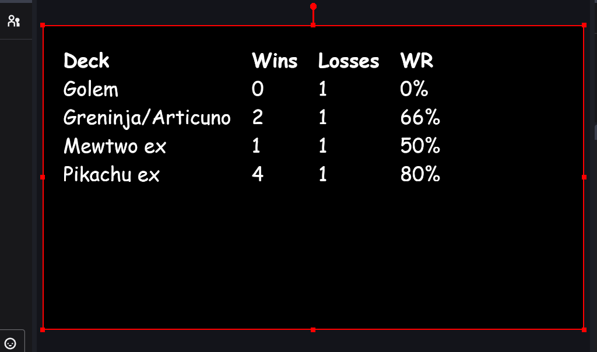
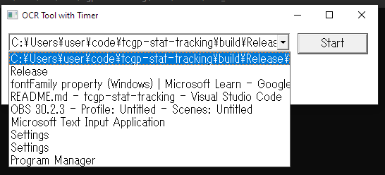
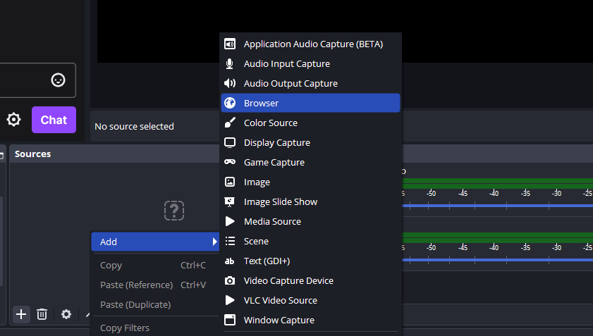
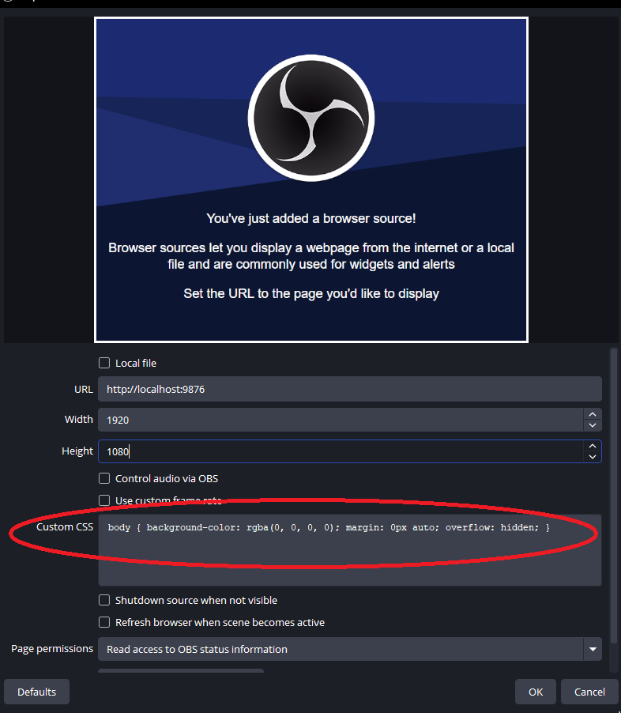

# TCGP Stat Tracking

Automatically track WRs for decks in Pokemon Trading Card Game Pocket.



## Usage
1. Download `deck_stats.zip` from Releases and extract `deck_stats.exe` or build it.
2. Run `deck_stats.exe`.
3. A window will pop up asking you to select a window. Choose the window of your phone. (If you ran the program before your phone window was created, you will need to restart the program.)
   

4. A `deck_stats.csv` file will be saved and loaded when the program runs.
   You can edit this manually or import/export it from/to a spreadsheet program.
5. Add `http://localhost:9876` as a browser source in OBS to display stats on stream.
   
6. You can adjust other settings like the font, font size, and font color with custsom CSS.
   
7. For example, this will set the font to Comic Sans MS in white at 70px.
   ```
   body { background-color: rgba(0, 0, 0, 0); color: white; margin: 1em; font-family: 'Comic Sans MS'; font-size: 70px }
   ```

## How it works
The program asks you for a window to take screenshots from, which should be set to your phone window. Then the program takes screenshots of the window every 0.5 seconds and performs OCR on them. Based on the text, the program determines what deck you're using and whether you've won or lost. 

## Build Executable
1. Install CMake.
2. Install Visual Studio with stuff to make C++ programs.
3. ```
   mkdir build
   cd build
   cmake .. -G "Visual Studio 17 2022" -A x64
   cmake --build . --config Release
   ```